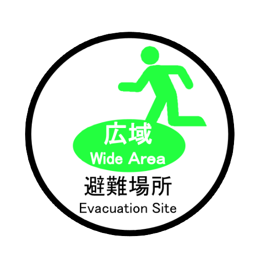

# まもるくん　防災マップ

## アプリの使い方

マップ上のアイコンをクリック(タップ)することで広域避難場所とイ一時避難場所の公園に関する情報を表示することができます。
従来の防災情報では記載されることが少ない防災設備の情報が付与されています。

アイコンはそれぞれ以下の通りです。
- 広域避難場所


- 一時避難場所


## 開発背景
**防災**は、日本全国の課題であり、宇都宮においても例外ではない。宇都宮における具体的な災害は地震による建物の倒壊や地震に伴う火災の発生、川の氾濫による水害などが考えられる。これらの災害の発生時、多くの被災者は学校や市役所などの施設を利用し避難生活を行うが災害発生直後にはそれらの避難場所に行く前に緊急避難場所に避難することが考えられる。緊急避難場所には公園が指定される場合があり、避難者が避難生活を行う上で必要な設備が備えられているが、それらを効果的に使用するためには平時からの情報提供が必要である。そこで、防災公園の立地や機能を示した防災マップを作成することにより、災害時に避難場所の選択肢が広がることが期待される。

公園は近隣住民にとって関わりが深く、親しみやすい場所である。平時より公園の防災機能を知ってもらうことにより、災害時において円滑な避難が行えたり、効果的に防災設備を利用したりすることができると考えられる。

**まもるくん**は、宇都宮市が公開するオープンデータを活用しユーザーの防災意識の向上を促進する目的で作成したWebアプリケーションである。 オープンデータとして公開されているcsv形式の防災公園情報を地図上に可視化し、位置情報を提供する。また、フィールドワークによって得た防災設備の詳細を付与することでユーザが公園の防災設備の情報を得ることが可能になった。ユーザーにとって普段馴染みがない公園であっても、公園の防災設備情報を地図上に表示することで、その存在を知る事ができる。モバイル版でも同様の操作が可能であるが、将来的には、携帯端末のGPS情報を利用して付近の防災公園の把握な機能を付加させる予定である。それにより、地元住民だけでなく、他地域の人々も付近の防災公園検索に活用できる。

今後は、公園以外の防災施設に関しても同様の施設情報の掲載を行こなったり、スマホアプリとしての開発を行ったりすることを考えている。

## 使用データ
この「**まもるくん**」は以下の著作物を改変して利用しています。

- 「指定緊急避難場所一覧（推奨データセット準拠）」、宇都宮市、クリエイティブ・コモンズ・ライセンス表示2.1 http://creativecommons.org/licenses/by/2.1/jp/

* 広域避難場所(公園のみ)
* 一次避難場所(公園のみ)

## 使用アイコン

* 広域避難場所/一時避難場所 アイコン作成者 : 鈴木 潤季, 小笠原 大貴

このアイコンはMITライセンスの元に公開されています
```md
Copyright (c) 2022 Suzuki Mitsuki, Ogasawara Hiroki
Released under the MIT license
https://opensource.org/licenses/mit-license.php
```
## 使用ライブラリ
* Map: Leaflet, MapBox
* UI: Bootstrap
* Data: geopandas

## チームメンバ-

現在公開許諾確認済みのメンバーのみ掲載しています

- 石塚 駿(リーダー兼説明監修)
- 齋藤 響(防災公園の説明監修)
- 高橋 駿平(取材調整・マネジメント)
- 鈴木 潤季(ロゴ作成)
- 小笠原 大貴(ロゴ作成)
- HinataKikuchi(開発)

# 連絡方法

githubのIssue機能等をお使いください
